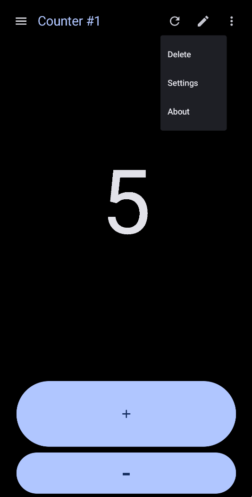
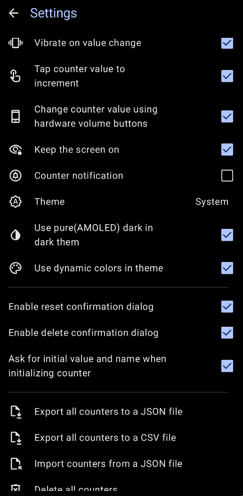
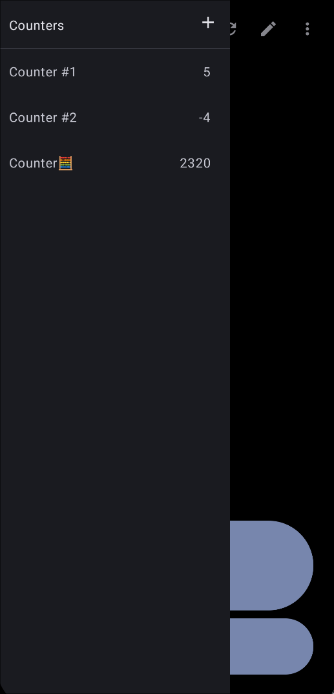
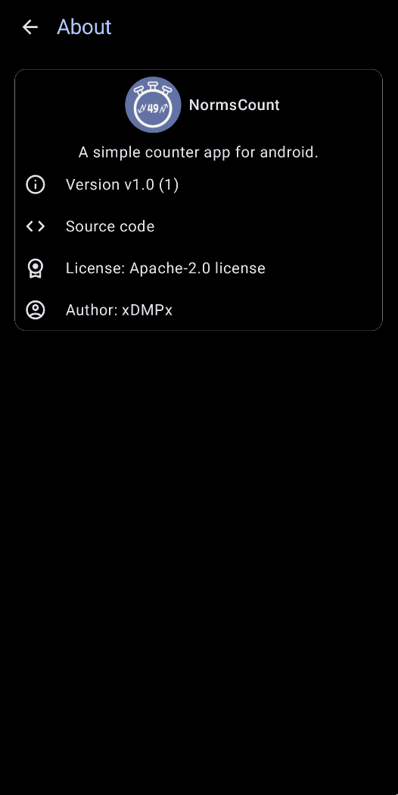
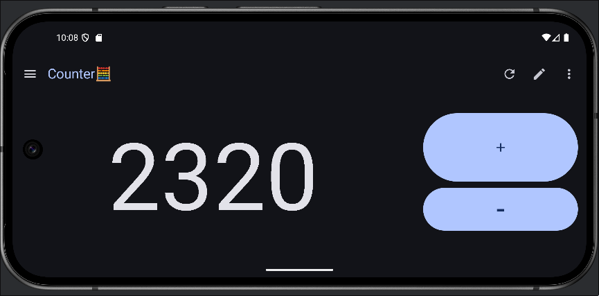

#  NormsCount 

A simple tally counter app for android in Jetpack Compose.

## Preview

## Features

 - Support for multiple independent counters
 - Counter naming
 - Vibration on value change
 - Notification with current counter
 - Keeping the screen on
 - Change values via:
    - tapping counter value to increment, long pressing to decrement
    - volume buttons
    - notification
 - Theme control
 - Support for AMOLED dark
 - Exporting and importing (JSON, CSV)
 - Counter creation with provided start value
 - Counter reseting
 - Nagative values support

## Building

To build it, clone the repository, open the project in Android Studio, and then build and install it on an Android device or emulator.

## Downloads 

The application is currently distributed only as APK via [releases](../../releases) page.

 

## License

This project is licensed under [Apache-2.0](LICENSE) License.
